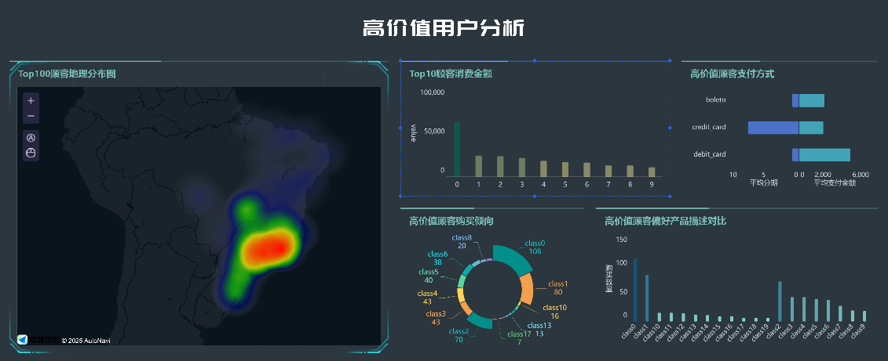
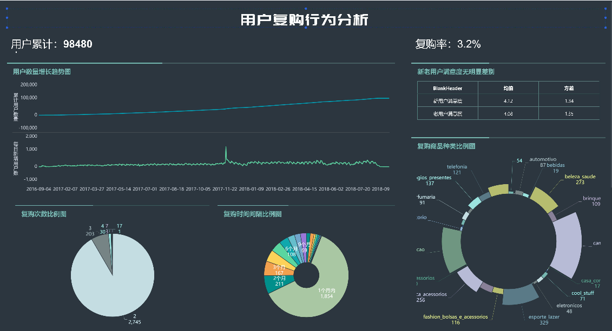
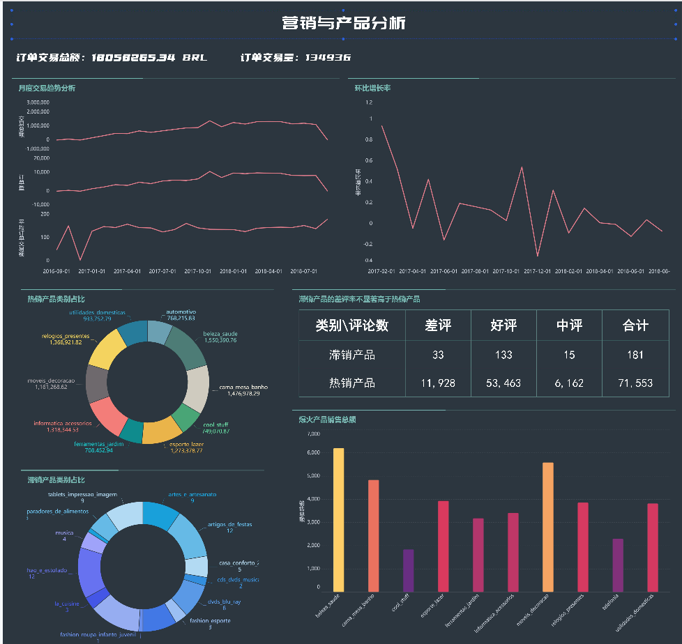
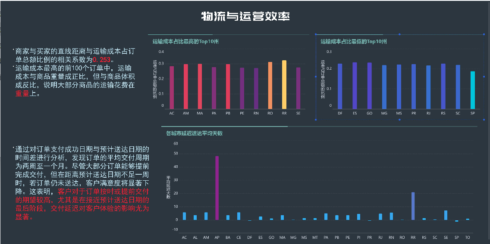
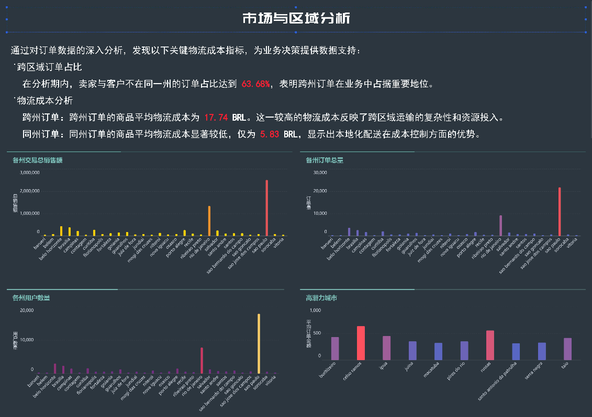

# Brazilian_E-commerce_analytics

基于 Brazilian E-Commerce Public Dataset，从 **顾客行为、销售与产品、物流与运营效率、市场与地理扩展、支付与评价反馈** 五个维度展开分析。

## 顾客行为：

1. **高价值顾客识别**
    - Top 100的客户（按订单总金额)
    - Top 100的顾客的地理分布
    - Top 100的顾客的偏好的产品类别
    - Top 100的顾客的购买数量最多的前20种产品类别、平均描述长度、平均照片数量、平均名称长度、 平均重量
    - Top 100的顾客的支付方式与平均订单价值（AOV）
    
2. **顾客复购行为分析**
    - 用户数量增长曲线
    - 计算整体复购率（至少购买2次及以上的客户占比）
    - 复购客户的购买时间间隔
    - 复购订单中高频产品类别（对比首次购买）
    - 复购客户的评价评分是否显著高于单次客户

## 销售与产品：

1. **销售趋势与季节性**
    - 环比增长率
    - 销售额排名前10的产品类别及占比

2. **滞销与热销产品分析**
    - 销量增长最快的Top 10产品类别
    - 结合评价数据，分析滞销产品的差评率是否显著高于热销产品

## 物流与运营效率：

1. **运费成本分析**
    - 运费最高的Top 100订单特征（如距离、产品重量/体积）

2. **配送时效与客户满意度**
    - 延迟订单的客户评分是否显著更低
    - 延迟订单的地理分布（城市）

## 市场与地理扩展：

1. **区域渗透率分析**
    - 按城市统计：订单量、销售额、客户数
    - 低渗透率但高增长潜力的区域（如订单量少但客单价高）

2. **跨区域销售分析**
    - 卖家与客户不在同一州的订单占比
    - 跨州订单的物流成本是否显著更高

## 支付与评价反馈：

1. **支付方式对订单完成率的影响**
    - 平均订单金额
    - 分期支付的平均支付金额

2. **是否存在同一卖家的差评集中现象

---

### 代码实现方式：SQL和HQL

### 部分结果BI可视化展示

